# Web Typografie (2022/2023)
Minor Vid, Rosella Moens


## Dag 1 (10/10/2022)
### Start project
Voor het visueel maken van het geluid van dit **filmfragment uit Blade Runner 2049**, heb ik deze meerdere malen bekeken. Ik ben direct daarna een paar basis elementen op gaan zetten: ik heb hier bijvoorbeeld de tekst over de video geplaatst en twee voices van een typografie voorzien. 

### Personaliteit in voices 1, 2 & 3
Ik heb gekozen om van Benner gebruik te maken, omdat deze variaties helpen bij het inzichtelijk maken van de personages en toon die zij in hun stem hebben, die een doof persoon niet kan horen maar wel met beeld kan associeren. 

* ***Voice 1*** Vanaf het moment dat ik voice1 hoorde, wist ik dat dit bij een monospace font hoorde. Het voelt alsof een AI spreekt, het is monotoon en voelt robotisch, wat de kern van Brenner Mono omschrijft. 
* ***Voice 2*** Voor het personage K had ik moeite met het uitkiezen van een font. Het leek me geschikt om een font te kiezen die neutraal is maar wel persoonlijkheid heeft. K is een 'stoere' blade runner en daardoor leek een harde, bolde variant van Brenner mij geschikt. 
* ***Voice 3*** Voice 3 is de man die 1 line zegt, namelijk: 'Fuck off, skin-job!', wat negatief en aggressief wordt geuit richting K. Hierbij past ook een bolde variant van Brenner, echter is deze in uppercase getransformeerd met text-transform. Uppercase text is in-your-face en aanwezig, net als de aggressieve toon van deze man.

### Tekst laten staan
Ik wilde met behulp van CSS sommige p's tijdelijk laten staan nadat deze de off-class krijgen, aangezien het dialoog van de Baseline Tests erg snel verloopt. Ik heb hiervoor verschillende opties uitgeprobeerd.

**Transition delay:** werkte niet op beide elementen & op on en off classes.
**Opacity: 1;:** zorgde ervoor dat deze tekst _altijd_ zichtbaar bleef, wat niet geschikt was.
**CSS animatie van opacity 1 > 0:** is nu de oplossing die ik heb gekozen. De animatie zorgt voor een verloop van de opacity en heeft een duratie die langer duurt dan de tijd dat de tekst er staat.


### Sound animatie/visualisatie
Ik ben ook begonnen met het spelen met de geluiden uit de sounds array: Hoe geef je een luid geluid vorm zonder het te omschrijven in tekst? Mijn eerste idee hierbij heb ik uitgewerkt voor het eerste geluid.

***Sound 1*** Sound 1 is een luide beep die uit 1 geluid bestaat. Om dit visueel weer te geven heb ik de video-container en body gestyled wanneer het geluid afgaat. De videocontainer schudt met behulp van animation siren-1-movement en de body krijgt verschillende flikkerende achtergrondkleuren met animation siren-1-background. Deze movement in de animaties loopt op het geluid.


## Dag 2 (11/10/2022)
### Repeating text ("Within cells interlinked")
Op .p41, .p42 en .p34 wordt dezelfde zin 3 keer herhaald. Ik wilde deze apart weergeven zodat het in de captions duidelijk is dat dit 3 keer wordt gezegd, aangezien het huidig op zijn plek blijft staan.

**Styling:** De eerste twee malen dat K deze zin zegt, worden deze met behulp van de staying-text animation laten staan. Vervolgens wordt de laatste keer dat K dit zegt vormgegeven met een grote fontsize en duidt dit de laatste zin aan van deze test. 
**Interval:** Om deze laatste zin ritme en belang te geven, heb ik gebruik gemaakt van transitions inclusief transition-delays om deze woorden woord voor woord te laten verschijnen op het scherm, wat impact creëert.

### Sound animatie/visualisatie 2.0
Ik ben vervolgens weer gaan luisteren naar andere geluiden in het eerste fragment. De volgende sounds heb ik gevisualiseerd:
***Sound 3*** Sound 3 smelt samen met sound4 en is gelijk aan sound5 en sound7. Het is een laagtonige zoem, die voor de pieptoon van het vorige geluid plaatsvind. Omdat dit de opbouw weergeeft, heb ik voor de visualisatie een gradient gebruikt. Deze gradient beweegt van rechts naar links en geeft dus een opbouwend moment voor het geluid en beeld erna.

***Sound 4*** Sound 4 is het nageluid van sound3 en is gelijk aan sound6 en sound8. Het is een hoge pieptoon. Aangezien deze tonen (sound3 en sound4) samenkomen nadat K een 'juist' antwoord geeft, heb ik beide elementen groen gekleurd: dit geeft een confirmatie aan. Het piepgeluid wordt visueel gerepresenteerd door een scherpe felle groene kleur die zonder verloop in het scherm verschijnt.

### Animation resets
Het kostte mij veel tijd om de animaties die ik had gemaakt voor de sound visualisaties (zie hierboven) te stacken. Het kwam voor dat de animaties enkel 1 keer afspeelde. Met Vasilis heb ik gekeken naar mogelijke opties. Het was niet mogelijk om de animaties op de volgende sound te verwijderen, omdat hier nieuwe animaties op stonden. In JS heb ik een paar dingen geprobeerd, wat ik niet voor elkaar kreeg. Uiteindelijk zijn we voor de tijdelijke oplossing gekomen om de CSS animaties apart te maken voor al die verschillende sounds. Dus inplaats van dit:
```css
body.sound3,
body.sound5,
body.sound7 {
	animation: green-gradient 1.5s ease-in;
}
```
Naar dit:
```css
body.sound3 {
    animation: sound-3-gradient 1.5s ease-in;
}

body.sound5 {
    animation: sound-5-gradient 1.5s ease-in;
}
```
### Tweaks
Verder heb ik tweaks gedaan aan:
* Het scherm waarop de zin die voice3 zegt verschijnt had nog een gebrek aan impact. Hier heb ik de tekst naar het midden geplaatst en een groter formaat gegeven. Ook de color red toegevoegd in plaats van crimson, voor een consistenter kleurenpalet.
* De herhalende teksten van K en de tester zoals: "Cells, cells" en "Interlinked, interlinked", heb ik meer visuele ruimte gegeven door deze groter te maken. Ze vullen zo mooi de ruimte aan de linkerzijde van K tijdens de scene.
* Hiërarchie in CSS-file voor mijn eigen overzicht.


## Dag 3 (12/10/2022)
### Sound animatie/visualisatie 3.0
***Sound 9*** Sound 9 is de aanhoudende pieptoon in de test scene. Dit geluid is vervelend en scherp. Deze pieptoon wordt steeds luider: het is overheersend en valt je oren lastig. Om dit voor Doven even irritant te maken, heb ik met animaties verschillende visualisaties uitgeprobeerd. Bijvoorbeeld het laten flashen van verschillende background-colors die steeds sneller flikkeren (Zie afbeeldingen). Dit vondt ik echter nog te subtiel en niet vervelend genoeg.

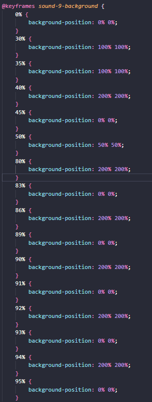 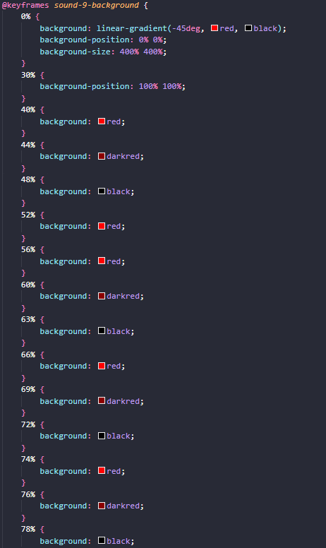

De volgende test was geïnspireerd door een [Codepen](https://codepen.io/web_designer_sanchit/pen/aaVPzq) die ik had gevonden. Deze maakt gebruik van een image overlay om zo een _glitch effect_ te creëeren. Dit kan je subtiel weergeven, maar met mate dit met snelheid wordt afgespeeld is het behoorlijk irritant. Hiervoor heb ik meerdere overlay afbeeldingen getest nadat de animatie in elkaar gebouwd was. 

  

### Repeating text ("Within cells interlinked") 2.0
#### Feedback (12/10)
Tijdens het voortgangsgesprek duidde Vasilis erop dat de laatste zin geschreeuwd lijkt te worden door het formaat in contrast met de rest. Het is namelijk zo dat deze tekst over de hele video wordt weergegeven. Dat wilde ik graag aanpassen zodat het niet verwarrend is voor deze doelgroep. Ik wilde wel belang geven aan deze zin omdat dit het einde is van de test, maar het niet groot en schreeuwend weergeven.
Ik heb dit opgelost door deze zin onder in het scherm te zetten en een groene kleur te geven.

## Dag 4 (13/10/2022)
### Personaliteit in voice 4
Voice 4 heeft een kleine toevoeging aan het fragment. Hij verteld K dat hij zijn bonus op kan halen. De stem van Voice4 is neutraal en bijna vriendelijk. Ik wilde dit visualiseren door een andere variatie van Brenner te gebruiken: Brenner Slab. Door de slabs is het nog wel robot-achtig en monotoon, maar heeft het meer persoonlijkheid. Het oogt vriendelijk en neutraal. 

### Scaling variaties in scenes
Door geluiden en het gebrek aan geluiden heb ik op verschillende plekken in het fragment gespeeld met scaling van de video-container. Hier moest ik veel aan tweaken, omdat bepaalde animaties wel/niet een forwards property hadden op de animation-fill-mode. 
* Aan het begin van het fragment (sound0) schaalt het scherm op door het toenemende geluid.
* De video schaalt vervolgens weer langzaam op tijdens het aanhoudende piepgeluid in de 'Cells'-scene.
* De video schaalt direct af nadat de 'Cells'-scene voorbij is en de pieptoon stopt.
* De video schaalt op nadat het fragment voor de tweede baseline test begint.

## Dag 5 (17/10/2022)
### Adding Decoration
Ik wilde mij meer verdiepen in hoe ik meer ornamentatie en 'nonsense' toe kan voegen aan dit fragment. Ik wil graag de look & feel zo behouden maar daardoor kunnen externe elementen juist nog meer opvallen.
Ik heb voor dit onderwerp specifiek onderzoek gedaan naar tekst decoraties en toevoegingen in CSS. Ook heb ik geprobeerd met illustraties te werken. 


***Lines & Grid*** 
Een trend in design is het laten zien van hulplijnen en grids, wat ik heb geprobeerd na te bootsen in een basis. Al snel concludeerde ik dat het niet goed paste bij de video en bovendien in de weg zit.

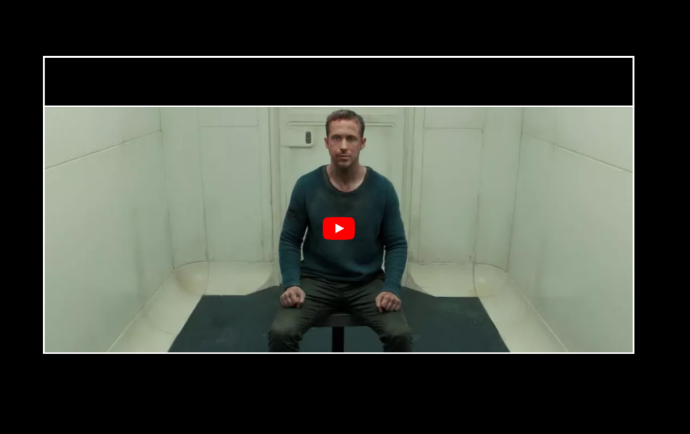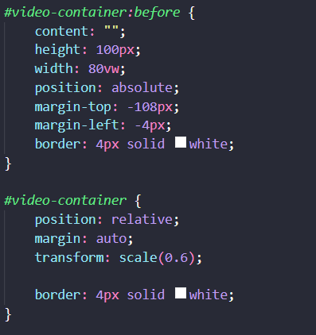


***Illustraties*** 
Ik heb een paar screencaps van het filmfragment met witte lijn overgetrokken met Procreate. Ik heb een paar testen gedaan met overlap en positionering tijdens verschillende states.

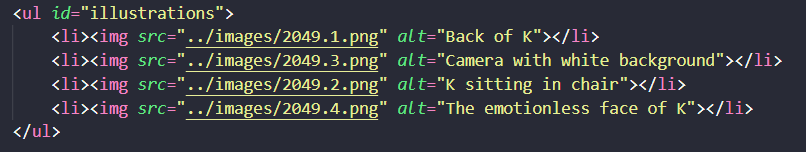 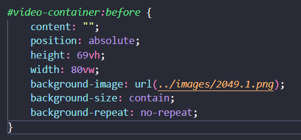
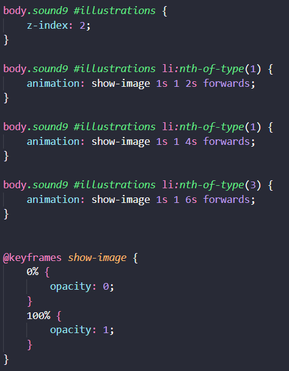 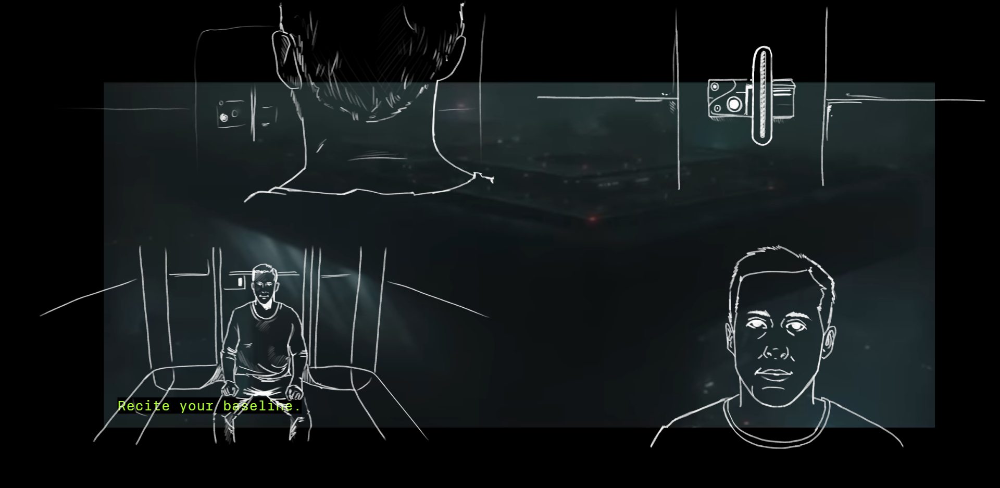

Illustraties worden weergegeven aan het begin van het fragment, totdat sound1 afspeelt. Illustraties verschijnen tijdens de 'Cells'-scene en blijven staan op fullscreen tot de volgende.


***Title of clip: Baseline Test*** 
Om meer impressie te geven van het fragment zelf op de landingspage voordat de video wordt afgespeeld, wilde ik de titel weergeven. Met inspiratie van een codepen die ik had gevonden had ik gespeeld met lijnen. Toen het niet gelijk werkte met de lijnen in de clippath van de tekst, vond ik dat eigenlijk visueel aantrekkelijker.

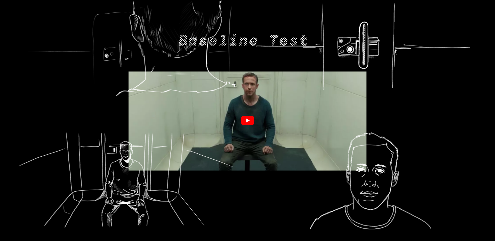 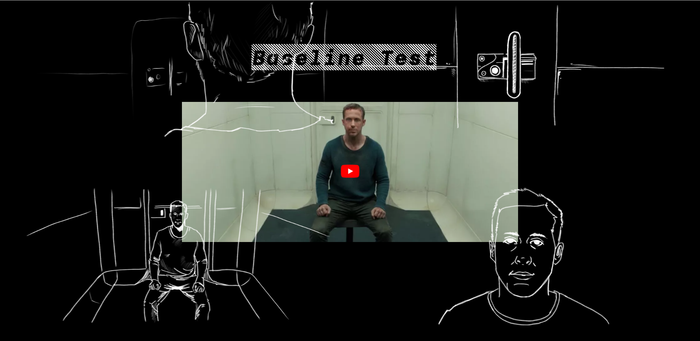
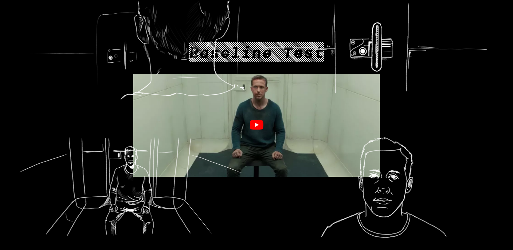

## Dag 6 (19/10/2022)
### Adding More Nonsense

